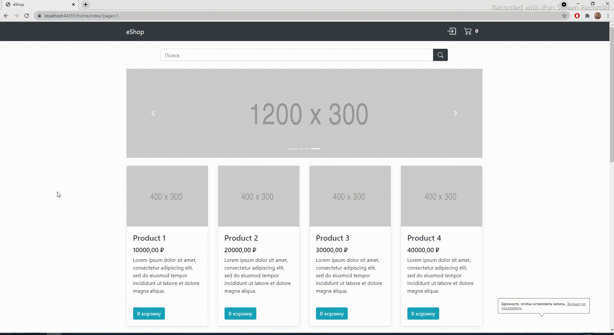
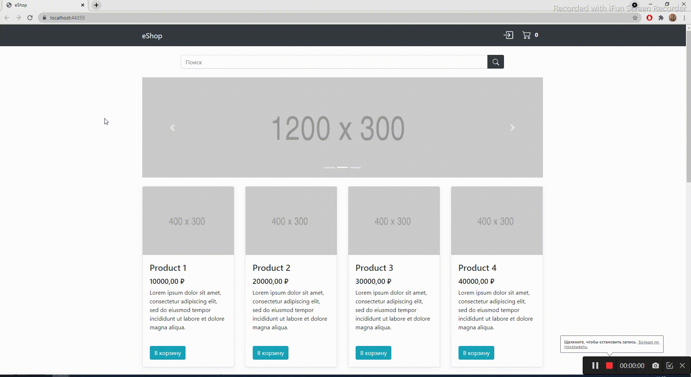

# eShop online store
Интернет-магазин для продажи различных товаров.
## Архитектура приложения
Приложение разбито на две части, в зависимости от выполняемых задач:
- слой пользовательского интерфейса и логики;
- слой работы с данными.
## Используемые технологии
Проект создан на ASP.Net Core v3.1.

Для хранения данных используется Microsoft SQL Server 2019.

Для работы с базой данных используются библиотека .NET Standart v2.1 и Entity Framework Core v3.1.

Для работы с аутентификацией и авторизацией используется ASP.NET Core Identity v3.1.

Для адаптивной верстки страниц используется Bootstrap v4.3.1.
## Возможности приложения и примеры работы
### Главная страница

### Просмотр карточки продукта
Для просмотра карточки продукта нужно нажать на изображение или название необходимого продукта.
Для возврата на главную страницу необходимо нажать на кнопку "продолжить покупки" или на логотип "eShop".

### Поиск

### Регистрация и авторизация
Чтобы воспользоваться личным кабинетом, а также совершать покупки необходимо зарегистрироваться или авторизоваться в системе.
Для этого нажмите на значок рядом с корзиной в верхнем правом углу.

### Добавление в корзину и оформление заказа.
Добавить товар в корзину можно с главной страницы или из карточки товара.

В корзине доступно:
- удаление позиций;
- увеличение/уменьшение количества одной позиции;
- переход к оформлению заказа.

Для оформления заказа необходимо заполнить данные получателя и нажать кнопку "оформить заказ". Поле "комментарий к заказу" является опциональным.

